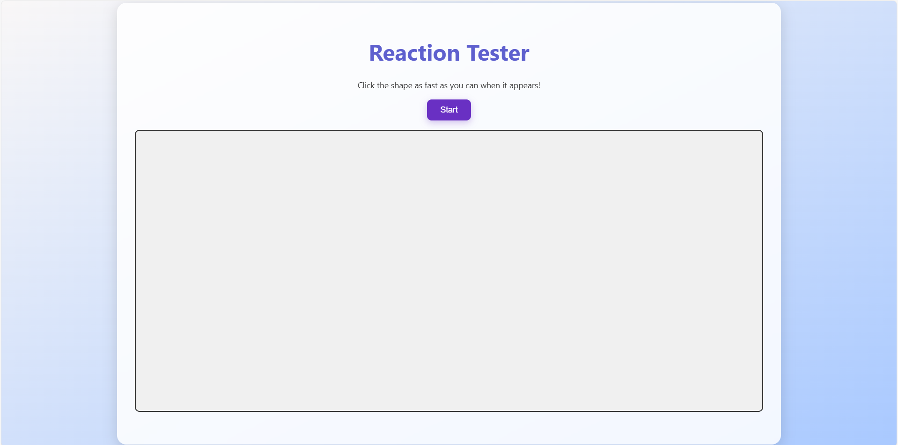

# ⚡ Reaction Tester

A vibrant and interactive **Reaction Time Testing App** built using HTML, CSS, and JavaScript. This mini-game measures how fast you can react to shapes appearing randomly on screen. With a sparkling white aesthetic, glowing accents, and smooth transitions, it offers a fun and energetic user experience.

---

---

## 🎮 Features

- ✨ Beautiful animated UI with gradients and glowing overlays
- 🟣 Shapes appear in random positions (excluding the main container area)
- ⏱️ **Reaction time** is displayed instantly inside the container
- 📊 **Average reaction time** is shown once you hit Stop
- 🖱️ Simple and elegant `Start` / `Stop` buttons
- 🚫 No pop-ups — all stats are cleanly integrated into the layout

## 🚀 How to Use

1. Click the **Start** button.
2. Wait for a shape to appear randomly on screen.
3. Click the shape as fast as you can.
4. Your **reaction time** appears in the main info container.
5. When you're done, hit **Stop** — your **average time** will be displayed inside the same area.

## 📁 Folder Structure

The project folder contains:

- `README.md` — This file  
- `index.html` — Main HTML page  
- `styles.css` — All the charming styling  
- `script.js` — JS for shape timing, placement, and stats  
- `picture.png` — Preview image used in README  

## 💻 Built With

- **HTML5** – Semantic structure  
- **CSS3** – Animations, gradients, responsive design  
- **JavaScript** – Event handling, timing logic, DOM updates  

## 🧠 Learnings & Concepts

- DOM manipulation  
- Handling dynamic layout without overlap  
- Smooth UI/UX design without alerts  
- Real-time performance tracking with average calculations  

## 💡 Future Enhancements

- Add sound feedback on shape click  
- Leaderboard for best reaction times  
- Switch between light/dark themes  
- Include difficulty modes or countdown rounds  

## 🌐 Live Demo

[🔗 Try it Live on Web](https://reaction-tester-online.netlify.app/)

---

Made with 💖 by Shashank Tiwari — because testing your reflexes should be as fun as it is fast.
